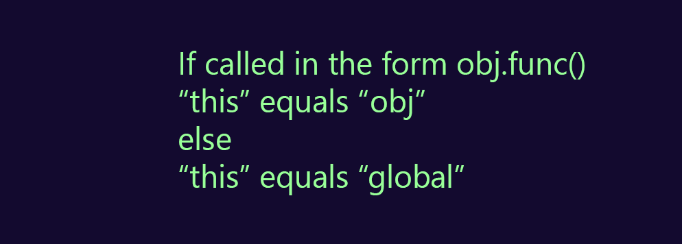

 - [ ] 1. Syntax; usage of const/let; single vs multiple params; returning objects;
 - [ ] 2. Functions: Regular vs. Arrow Functions; Regular Function Binding; Single-line vs Multiple-line Arrow Functions;
 - [ ]  Absence of the "function" keyword; It cannot be used as a function constructor
 - [ ] 3. 'this'
 - [ ] 3.1 What does 'this' reference to
 - [ ] 3.2 'this'
 - [ ] 3.3 What does it refer to

# Article: X_PLAYBOOK_NAME_X

___

## Syntax

- Syntax example
  - new operator
- const / let
- Parameters
  - Single
  - Multple
- Returning objects

___

## Functions

### Regular Functions
What are regular functions? 
- Binding

### Arrow Functions
- Single-line
  - Install GIT
- Multiple-line

| Function                            | Required? | Type       | Default | Purpose / Value                           |
| ----------------------------------- | --------- | ---------- | ------- | ----------------------------------------- |
| X_PLAYBOOK_NAME_X_apps              | no        | dictionary |         | Define what applications will be deployed |
| X_PLAYBOOK_NAME_X_apps.X_APP_NAME_X | no        | boolean    | true    | Deploy the application?                   |


```javascript
  function ask(question, yes, no) {
  if (confirm(question)) yes();
  else no();
}

ask(
  "Do you agree?",
  function() { alert("You agreed."); },
  function() { alert("You canceled the execution."); }
);
```
Edge cases: 

___

### Defining 'this'

The keyword 'this' refers to the object responsible for executing the current function.

In JavaScript, 'this' is used a bit differently, than in other languages like C++ or Java.

It is entirely determined by **how** a function is called, and not **where** it is defined.

We can simplify the usage of 'this', by the formula: 

<center>

</center>


</img>

If called inside an object method, 'this' references the object that the method belongs to.

```javascript
  class NameGenerator {
    constructor() {
      const btn = document.querySelector['button'];
      this.names = ['Max', 'Anna', 'George'];
      this.currentName = 0; 
      this.addName();  // 'this' here refers to the constructor
      btn.addEventListener ('click', this.addName); // but 'this' refers to the button object
    }

    addName() {
      const name = new NameField(this.names[this.currentName]);
      this.currentName++;
      if (this.currentName >= this.names.length) {
            this.currentName = 0;
        }
     }
  }
  const gen = new NameGenerator();
```

However, we can use methods like call(), apply(), and bind() to control what this refers to.
The call() and apply() methods are interchangeable. The only way they differ is the way they supply their arguments: call() allows passing arguments one by one, separating them with commas; while apply() uses an array. 
The bind() method allows passing an array or any number of arguments, but returns a new function.

We can use bind() in our example, since we don't know when the event will be fired, but we know the desired result.

```javascript
      btn.addEventListener ('click', this.addName.bind(this));
```

If called anywhere else, 'this' references the global object.

```javascript
  function ask(question, yes, no) {
  if (confirm(question)) yes();
  else no();
}

ask(
  "Do you agree?",
  function() { alert("You agreed."); },
  function() { alert("You canceled the execution."); }
);
```

There are a few other ways to handle and control what 'this' refers to.


### References

1. Defining 'this' : formula [Understanding Functions and 'this' In The World of ES2017](https://youtu.be/gvicrj31JOM)
2. 'this' in object method example: Project Documentation: [X_PROJECT_DOC_URL_X](X_PROJECT_DOC_URL_X)
3. 'this' in regular functions example: Project Documentation: [X_PROJECT_DOC_URL_X](X_PROJECT_DOC_URL_X)
