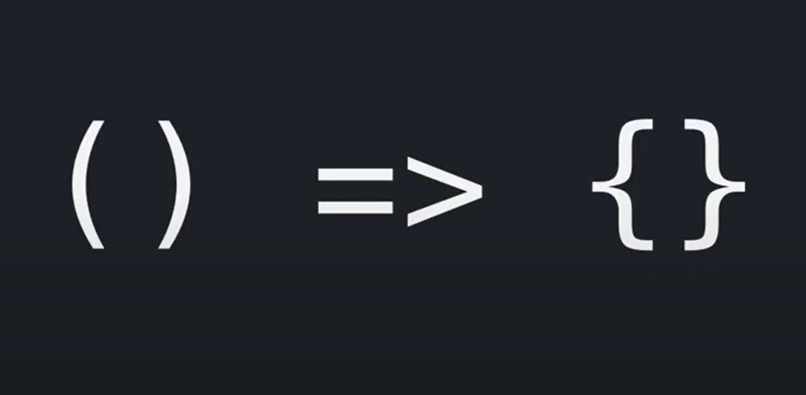
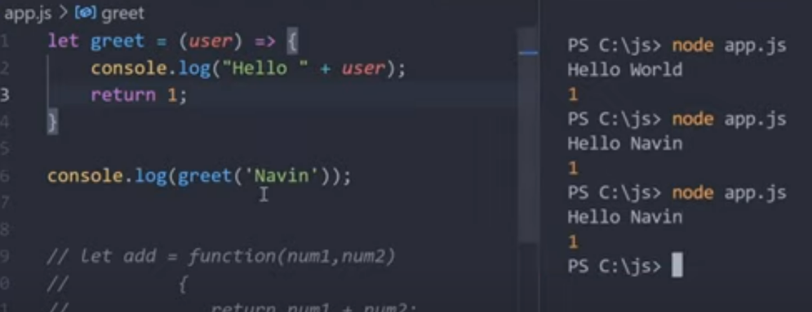

Absence of the "function" keyword
It cannot be used as a function constructor

# Article: Arrow Functions

In this lesson, we will get familiar with one of the most interesting and unique concepts in Javascript - Arrow Functions. 
Arrow functions are a compact alternative to the traditional function syntax. However, they are quite particular and so is their usage. 
Let's dive in!

//small changes to grammar. Lesson instead of lecture and replacing "of" with "in" refference to the unique concept in javascript//
___

## Syntax

The name of the function is derived from the 'fat arrow' we use in between the two sides of the function.
The left side represents the parameters and the right side consists of the expression or statement of the function. 

//we derive -> is derived, right side consists of....//

<p align="center">
    
</p>


___


### Comparing regular functions to arrow functions 

Let's take a look at a simple arrow function: 
//minor grammer change//

```javascript
//Arrow Function
  let func = (param1, param2, ..., paramN) => expression;  
```
That creates a function ```func``` which accepts parameters ```param1..paramN```, then evaluates the ```expression``` using their values and returns its result. This is a shorter form of the traditional function:

//that -> Which, that->this//

```javascript
//Regular Function
let func = function(param1, param2, ..., paramN) {
  return expression;
};
```

#### using ```const``` and ```let```

Now that we've covered some syntactic differences between regular and arrow functions, let's look at some variables.

```let``` is a block-scoped variable, which means that the variable dies when the block is done.
The variable that we declare with ```let``` can be modified, but not re-declared. We use it when we know that the value of the variable will change within its scope of operation.
//minor spelling and grammar
This, however, is not the case with ```const```.  They are also block-scoped, but they can neither be re-declared, nor changed.

<p align="center">
    
</p>

This, however, is not the case with ```const```.  They are also block-scoped, but they can neither be re-declared, nor changed.

___


### Parameters 

#### Single parameters 

When parsing a single parameter, neither a return statement, nor parenthesis are required, thereby making the function very short.

```javascript
let double = n => n * 2; // roughly the same as: let double = function(n) { return n * 2 }
alert( double(3) );
```

#### Multiple parameters

If we want to parse multiple parameters, we need them inside parenthesis.
//want->need//

```javascript
let sum = (a, b) => a + b;

/* This arrow function is a shorter form of:

let sum = function(a, b) {
  return a + b;
};
*/

alert( sum(1, 2) ); // 3
```
As you can see, (a, b) => a + b is a function that accepts two arguments named a and b. Upon their execution, it evaluates the expression a + b and returns the result.

//means->is, the->their

#### No parameters

If there are no parameters, parentheses will be empty (but they should always be present):

```javascript
let sayHi = () => alert("Hello!");

sayHi();
```


___

### Single-line Arrow Functions vs Multiple-line Arrow Functions

Single-line functions don't require body braces around the expression. 

```javascript
let sum = (a, b) => a + b;
alert( sum(1, 2) );
```

Multiline statements require body braces and a return statement. In this case, we've got multiple parameters, so we can see the full syntax.

```javascript
let sum = (a, b) => {  // the curly brace opens a multiline function
  let result = a + b;
  return result; // if we use curly braces, then we need an explicit "return"
};

alert( sum(1, 2) );
```

___

### Returning objects in particular

There are a few ways to return an object in an arrow function. Depending on the case, what is returned will be different and so will be the syntax.

The first and most common way is to use the longform syntax. It allows us to write variables before the ```return``` braces.

```javascript
const addCake = (name) => {
  return {
    name
  };
};

const cake_01 = addCake('Chocolate Cake');
console.log(cake_01);
```
//develop the example further 

A simpler way to write this will be wrapping the intended object in brackets like so:

```javascript
const addCake = (name) => ({
  name,
  price: 499
});
```

By doing this, we create an expression and therefore return an expression.

___

### Differences between Regular Functions and Arrow Functions

What are the differences? 

One of the main differences between them is the syntax. Please look at the section "Comparing traditional functions to arrow functions" to see a visual representation of this difference.
//that->this + minor spelling//

Another main difference is naming. We can not name an arrow function, however we can store it in a variable and access it that way.
Arrow functions are always anonymous.

[Storing a function in a variable example](https://youtube.com/clip/UgkxUmjy9O1HzRdT7u6ILrAtY2RRPMq4YCDM )

Second difference is that regular functions can be hoisted - what does that mean? It means that the function can be declared and call it before the actual declaration. This is not possible with an arrow function, because it doesn't have a name.
//hoisting example
//may->can. + it means that//

The third difference is that ```this``` gets handled differently within arrow functions. With arrow functions the "this" keyword always represents the object that defined the arrow function initially. A detailed description of this can be found in the link below.

//initially, of this you can find -> of this can be found//

[#2.4 'this' behaviour in Arrow Function vs. Regular Functions in JavaScript.](https://youtu.be/ebfXbjY5nhg )

Last, but not least, the fact that arrow functions do not have an arguments array, but instead they get bound to arguments of enclosing scope.

To recap, let's look at the differences listed in a table.

| Regular Function  | Arrow Function |
| ----------------- | ------------- |
| Traditional Syntax | (params) => {statements} |
| Can be named or anonymous | Always anonymous  |
| Can be hoisted  | Not possible, unless inside an object  |
| ```this``` can be used  | ```this``` will be global |
|Access to arguments |No access to arguments|


___
### Regular Functions: Binding


___

### Defining 'this'

In JavaScript, ```this``` is used a bit differently than in other languages like C++ or Java. The keyword ```this``` refers to the object executing the current function. It is entirely determined by **how** a function is called, and not **where** it gets defined. 

If we could simplify the usage of ```this```, it would look something like this: 

<p align="center">
    
</p>

If called inside an object method, ```this``` references the object that the method belongs to.

```javascript
  class NameGenerator {
    constructor() {
      const btn = document.querySelector['button'];
      this.names = ['Max', 'Anna', 'George'];
      this.currentName = 0; 
      this.addName();  // 'this' here refers to the constructor
      btn.addEventListener ('click', this.addName); // but 'this' refers to the button object
    }

    addName() {
      const name = new NameField(this.names[this.currentName]);
      this.currentName++;
      if (this.currentName >= this.names.length) {
            this.currentName = 0;
        }
     }
  }
  const gen = new NameGenerator();
```

In this example, we see that ```this``` will always point to the object that owns the object method.

We can use methods like ```call()```, ```apply()```, and ```bind()``` to control what ```this``` refers to.
The ```call()``` and ```apply()``` methods are interchangeable. The only way they differ is the way that they supply their arguments: ```call()``` allows passing arguments one by one, separating them with commas; while ```apply()``` uses an array. 
The ```bind()``` method allows passing an array or any number of arguments, but returns a new function.

We can use ```bind()``` in our constructor as our best bet, since we don't know when the event will be fired, but we do know the desired result.

//minor spelling, comma use etc//

```javascript
      btn.addEventListener ('click', this.addName.bind(this));
```

However, these methods are **NOT** suitable when using arrow functions!

At the global level, ```this``` is equivalent to a global object called ```global``` or ```window``` in browsers.
//this in arrow functions

### References

1. Defining 'this' : formula [Understanding Functions and 'this' In The World of ES2017](https://youtu.be/gvicrj31JOM)
2. 'this' in object method example [JS "this" and Function References - What is it all about?](https://youtu.be/Pv9flm-80vM)
3. [Arrow Function Basics](https://javascript.info/arrow-functions-basics)
4. [const and let variables](https://brad-bartlett.medium.com/es6-advancements-arrow-functions-and-const-let-variables-f82aa960b03d)
5. [Ways to Return an Object from an Arrow Function](https://ultimatecourses.com/blog/return-object-arrow-function)
